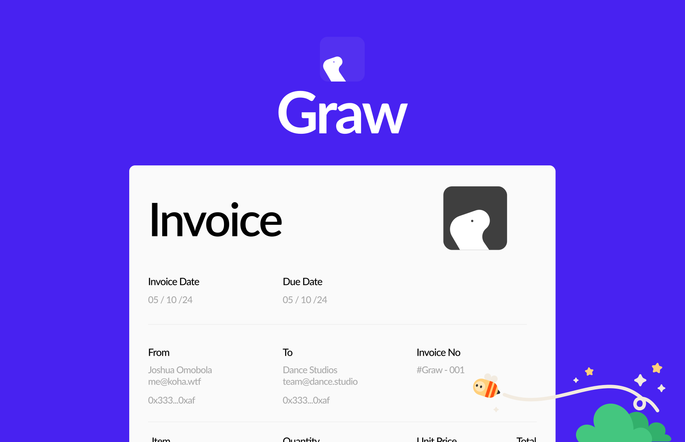
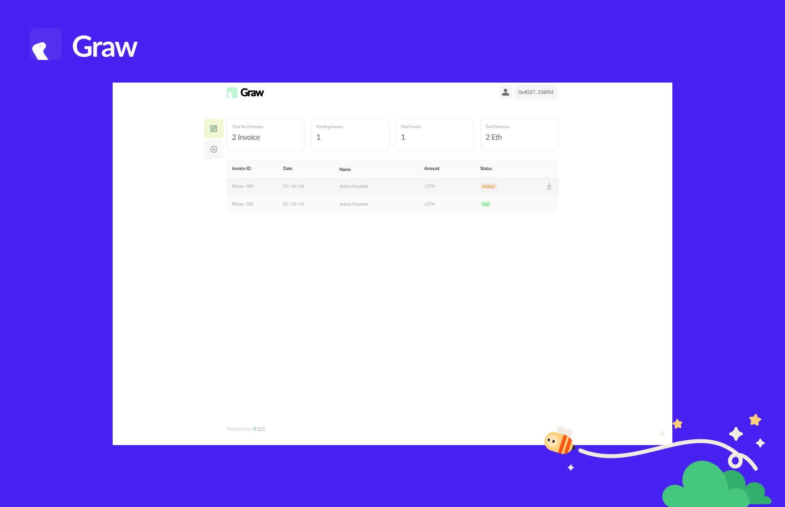
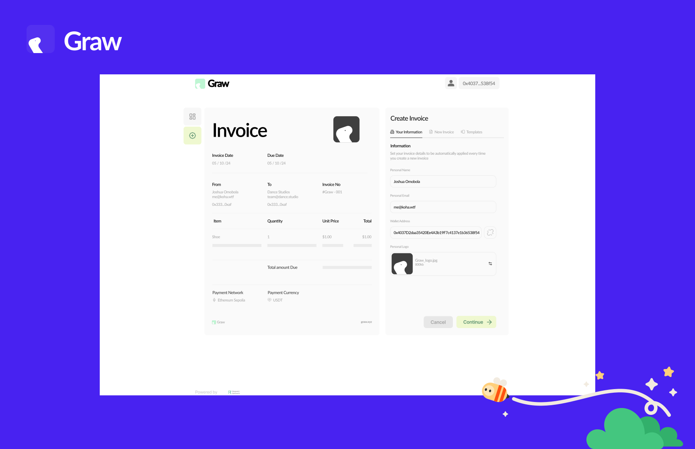

# Graw

**Create. Send. Get Paid Instantly**  
Graw is a modern, efficient invoicing solution designed to simplify and streamline payment processes. Whether you're an individual or a business, Graw allows you to create, send, and track invoices with ease, ensuring you get paid instantly with no strings attached.

Powered by [Request Network](https://request.network/)

---

## 🚀 Features

- **Quick Invoice Creation**: Create professional, customizable invoices in minutes.
- **Easy Payment Tracking**: Monitor payment statuses (Pending, Paid) for every invoice.
- **Blockchain Integration**: Supports payment on Ethereum Sepolia with multiple payment currencies like USDT.
- **Client & Personal Details**: Save client and personal information for streamlined invoice creation.
- **Downloadable Invoices**: Easily download and share your invoices in a click.
- **Analytics Dashboard**: Get insights into total invoices, pending payments, paid invoices, and total revenue.

---

## 🌟 Why Graw?

### Problem
Managing invoices and payments can be time-consuming and tedious. Tracking statuses, ensuring payments, and keeping records often require juggling multiple tools.

### Solution
Graw centralizes invoicing and payment management. With blockchain integration and a simple yet powerful interface, Graw ensures users can focus on their work while leaving payment hassles behind.

### Value Proposition
- **Speed**: Instant invoice creation and payments.
- **Simplicity**: A user-friendly interface for professionals and non-tech users.
- **Security**: Powered by blockchain for transparent and secure payments.
- **Innovation**: Combines modern invoicing with the latest Web3 technologies.

---

## 🛠️ Technology Stack

Graw leverages the following technologies:
- **Frontend**: React.js
- **Blockchain**: Ethereum Sepolia
- **Currency Support**: USDT and others
- **Integration**: Stripe API for seamless payment processing

---

## 🎨 Screenshots

### Overview

### Invoice Creation

---

## 🚧 Roadmap

1. **Phase 1**: Launch the core invoicing and payment functionalities.
2. **Phase 2**: Add support for multiple blockchains and currencies.
3. **Phase 3**: Advanced analytics and reporting tools.
4. **Phase 4**: AI-powered Account Statement and financial tool.

---

## 📢 How to Use

1. **Sign Up**: Create an account at [UseGraw.xyz](https://Usegraw.xyz).
2. **Create an Invoice**: Fill in client details, items, and payment preferences.
3. **Send & Track**: Share the invoice link and track payment status directly on your dashboard.
4. **Get Paid**: Instantly receive payments in your preferred currency.

---

## 📄 License

Graw is licensed under the [MIT License](LICENSE).

---

## 🌐 Contact

For support or inquiries, reach out to us:
- Email: me@koha.wtf
- Website: [UseGraw.xyz](https://Usegraw.xyz)

Let's simplify invoicing together! 🎉
